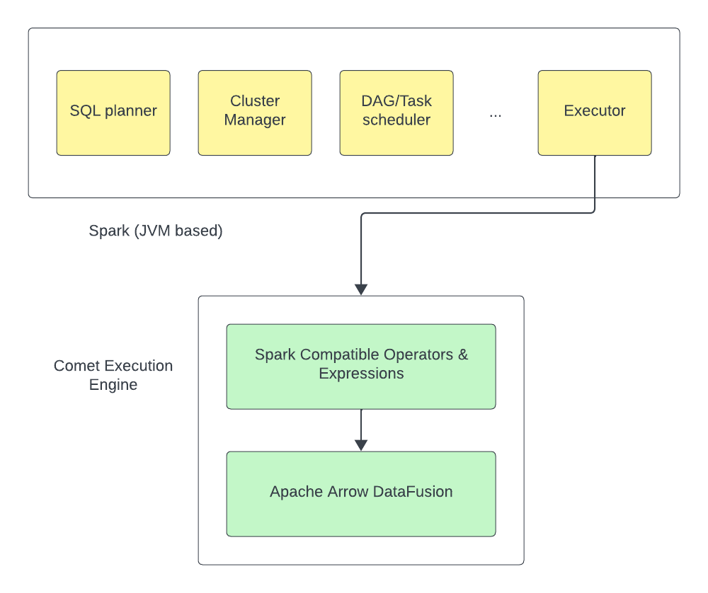

<!---
  Licensed to the Apache Software Foundation (ASF) under one
  or more contributor license agreements.  See the NOTICE file
  distributed with this work for additional information
  regarding copyright ownership.  The ASF licenses this file
  to you under the Apache License, Version 2.0 (the
  "License"); you may not use this file except in compliance
  with the License.  You may obtain a copy of the License at

    http://www.apache.org/licenses/LICENSE-2.0

  Unless required by applicable law or agreed to in writing,
  software distributed under the License is distributed on an
  "AS IS" BASIS, WITHOUT WARRANTIES OR CONDITIONS OF ANY
  KIND, either express or implied.  See the License for the
  specific language governing permissions and limitations
  under the License.
-->

# Comet Overview

Comet runs Spark SQL queries using the native Apache DataFusion runtime, which is
typically faster and more resource efficient than JVM based runtimes.

Comet aims to support:

- a native Parquet implementation, including both reader and writer
- full implementation of Spark operators, including
  Filter/Project/Aggregation/Join/Exchange etc.
- full implementation of Spark built-in expressions.
- a UDF framework for users to migrate their existing UDF to native

## Architecture

The following diagram illustrates the architecture of Comet:

## Current Status

Comet currently supports the following versions of Apache Spark:

- 3.2.x
- 3.3.x
- 3.4.x

Experimental support is provided for the following versions of Apache Spark:

- 3.5.x
- 4.0.0-preview1

Note that Comet may not fully work with proprietary forks of Apache Spark such as the Spark versions offered by 
Cloud Service Providers. 

## Feature Parity with Apache Spark

The project strives to keep feature parity with Apache Spark, that is,
users should expect the same behavior (w.r.t features, configurations,
query results, etc) with Comet turned on or turned off in their Spark
jobs. In addition, Comet extension should automatically detect unsupported
features and fallback to Spark engine.

To achieve this, besides unit tests within Comet itself, we also re-use
Spark SQL tests and make sure they all pass with Comet extension
enabled.
